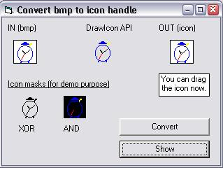



## Icon HandleMaker

### Description

I needed to convert a bitmap to an icon without having to save it to a file. Just getting a handle to the icon was sufficient, and fncMakeIcon does it. A second function fncConvertIconToPic converts an icon handle to an (almost) picture. I used it to check the good working of fncMakeIcon. And once it is in a picture box it can be easily saved to a file of course. (ZIP 5K). NEW UPLOAD
 
### More Info
 

             |
---                |---
**Submitted On**   |2005-05-20 04:54:02
**By**             |[Paul Turcksin](https://github.com/Planet-Source-Code/PSCIndex/blob/master/ByAuthor/paul-turcksin.md)
**Level**          |Beginner
**User Rating**    |4.9 (49 globes from 10 users)
**Compatibility**  |VB 6\.0
**Category**       |[Graphics](https://github.com/Planet-Source-Code/PSCIndex/blob/master/ByCategory/graphics__1-46.md)
**World**          |[Visual Basic](https://github.com/Planet-Source-Code/PSCIndex/blob/master/ByWorld/visual-basic.md)
**Archive File**   |[Icon\_Handl1889975202005\.zip](https://github.com/Planet-Source-Code/paul-turcksin-icon-handlemaker__1-60600/archive/master.zip)

